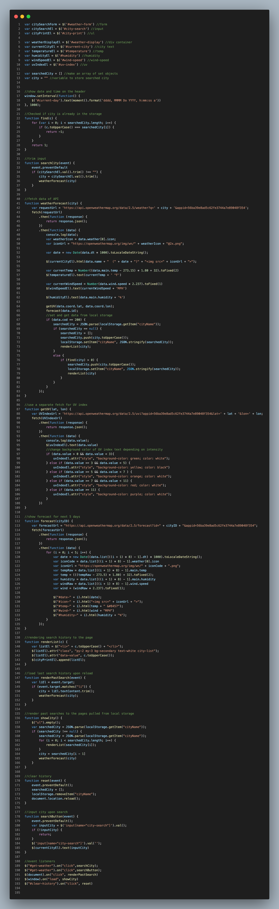

# Server-Side APIs Challenge: Weather Dashboard

## Table of Contents

* [Description](#description)
* [Screenshot](#screenshot)
* [Links](#links)

## Description
In this challenge, I was tasked to create a weather dashboard for today's forecast with a search function, and a 5 day forecast. At a minimum, it must show the city, temperature, wind speed, humidity and UV index with the date and an icon representing weather conditions. I must be able to save past searches in the history as well. 

I was able to successfully complete all the tasks and added functions such as display of date and time at the top of the screen as well as the option of clearing the search history. I also highlighted the UV index which changes color depending on its intensity. 

I used the OpenWeather api to pull data and to implement it on my screen. I primarily used bootstrap for my CSS framework and also used moment.js and jQuery. I am able to utilize google fonts to add more style on my screen. 

Lastly, I made my page compatible and readable with smaller screens. 

Usage of my 'weather tracker' is pretty straightforward. The user just have to input a city on to the search bar and the weather forecast will populate in the screen. 

## Screenshot
- HTML

- CSS

- JS

- Website

## Links
1. [Website](https://mlcundayag.github.io/weather-tracker/)
2. [Github](https://github.com/mlcundayag/weather-tracker)
